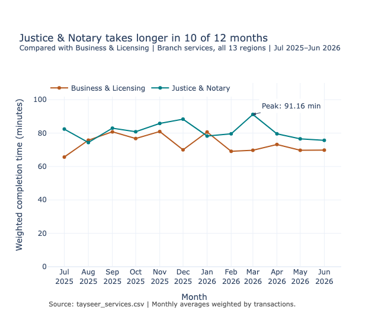
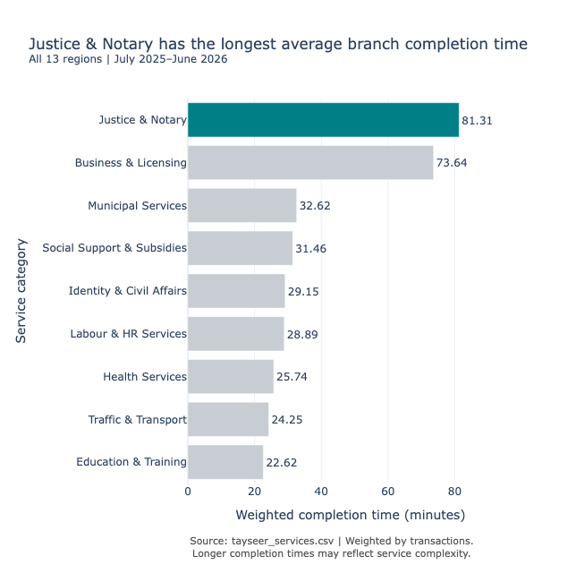

# Tayseer Branch Services: Where Should Completion Times Be Investigated?

**Course:** Data Visualization and Storytelling  
**Student:** Najla Saad Almutairi  
**Academy:** [SDAIA Academy](https://github.com/SDAIAAcademy)

## Project overview

This project uses `tayseer_services.csv` to identify which branch service category should receive priority investigation for long completion times. It combines a comparison of nine service categories with a monthly comparison of the two categories with the longest annual averages.

## Audience, decision question, and scope

- **Audience:** Tayseer’s service operations manager.
- **Decision question:** Which service category should receive priority investigation for long branch completion times?
- **Scope:** Branch services across all 13 regions, covering July 2025–June 2026, the latest 12 months in the supplied dataset.
- **Metric:** Transaction-weighted average completion time, measured in minutes.

## Finding → evidence → recommended action

**Finding:** Justice & Notary is the first candidate for investigation because it has the longest transaction-weighted average branch completion time among the nine categories.

**Evidence:** During July 2025–June 2026, Justice & Notary averaged **81.31 minutes** across **1,893,582 transactions**. Business & Licensing ranked second at **73.64 minutes**, a difference of approximately **7.68 minutes**, calculated before rounding. Justice & Notary also took longer than Business & Licensing in **10 of the 12 months**, reaching **91.16 minutes in March 2026**. Its monthly average fell from **82.37 minutes in July 2025** to **75.68 minutes in June 2026**; the evidence therefore shows a persistent difference between the categories rather than a steadily worsening trend.

**Recommended action:** Prioritize a diagnostic review of Justice & Notary branch services. First compare regions and specific service types, then examine process steps and case complexity to identify where long completion times arise. Review the March 2026 peak and compare similar cases before selecting a process improvement or setting a reduction target. Keep Business & Licensing as a secondary investigation candidate.

## Visual evidence

### 1. Monthly completion times

The line chart shows monthly variation for the two categories with the longest annual averages. The March peak is annotated.

[Download the interactive monthly chart](charts/monthly_completion_interactive.html)

### 2. Comparison of service categories

The horizontal bar chart ranks all nine categories and highlights Justice & Notary.

[Download the interactive category chart](charts/category_comparison_interactive.html)

The PNG images are visible directly in this README. To use hover details, zoom, and legend controls where available, download the HTML files and open them in a browser. GitHub’s normal file view does not run the interactive charts.

## Data and method

The supplied dataset contains **28,080 rows and 12 columns**, spanning July 2021–June 2026. Each row represents one month × region × service category × channel. Checks found no missing values, no duplicate records on these four keys, and no zero or negative transaction counts.

The analysis:

1. Converts `month` to a datetime value.
2. Filters to `channel == "Branch"` and July 2025–June 2026, retaining **1,404 rows**.
3. Multiplies each row’s `avg_completion_min` by its `transactions`.
4. Sums these products and transaction counts for each required group.
5. Divides the summed products by the summed transactions:

**Weighted completion time = Σ(avg_completion_min × transactions) / Σ(transactions)**

The category chart aggregates by service category across the full 12-month period. The line chart aggregates by month and service category, then selects the two categories with the longest full-period weighted averages. Annual results are calculated from the underlying transaction totals, not an unweighted average of monthly averages.

This weighting assumes that each row’s average completion time describes its reported transactions. Calculations retain full precision; displayed completion times are rounded to two decimal places. The repeated `digital_adoption_pct` field is not used, summed, or treated as independent channel observations.

## Limitation

Longer completion times do not by themselves establish poor performance. Justice & Notary may involve more complex cases or additional required procedures, and this analysis does not adjust for those differences. National weighted averages can also conceal regional variation. These results support investigation, not a causal claim or a guaranteed estimate of time savings.

## Chart design and AI assistance

A line chart was chosen to show monthly variation and whether the difference between the two selected categories persists over time. A sorted horizontal bar chart makes all nine categories easy to compare while allowing space for their names; teal consistently highlights Justice & Notary, and both charts use zero-based axes. AI assisted with pandas and Plotly code, wording, and layout suggestions. I ran the analysis in Colab, reviewed the displayed data checks and summary tables, and inspected exported chart images while correcting the peak annotation placement.

